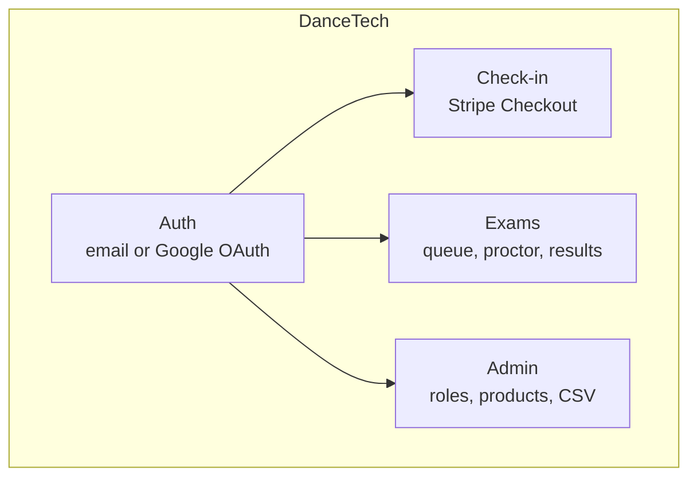

# DanceTech

Check-in, payments, and advancement exams for a weekly West Coast Swing community. Built for the [Greenville Westies](https://greenvillewesties.com/), but the exam YAML, Stripe product metadata, and role model are meant to be reused by another studio.

Cards never touch this server. Stripe hosted Checkout collects payment; this app creates the session, shows a receipt, and uses Stripe product metadata to decide who can buy what.

## What it does

- **Accounts** — email/password (Argon2) or Google OAuth. JWT access/refresh cookies, sessions in Redis.
- **Check-in** — shopping cart in Redis, Stripe Checkout, class products gated by roles and optional time windows.
- **Exams** — YAML-defined tests, a live queue, proctor scoring (including live grading), and roles granted on a pass.
- **Admin** — roles, product refresh from Stripe, CSV exports of users, exams, and current roles.

## Stack

Rust / Axum / Askama / HTMX, PostgreSQL (sqlx), Redis, Stripe Checkout. UI is Tailwind + Flowbite, vendored locally ([why not a CDN](https://blog.wesleyac.com/posts/why-not-javascript-cdn)).



## Design

**One source of truth for URLs.** Every path lives on `ROUTES` in [`src/app/router.rs`](src/app/router.rs). The Axum router, redirects, and Askama templates all read that struct (`rts.login`, `ROUTES.check_in`). Parameterized paths are methods on the same type (`administer_exam`, `queue_query`) so a rename cannot drift between Rust and HTML.

**Shared strings live in structs, not literals.** The same idea applies to HTML ids that HTMX targets across templates: each feature has an `Ids` struct and an `IDS` constant (see `src/exam/views.rs`, `src/check_in/views.rs`, `src/app/views.rs`). Handlers and templates use those fields so a typo in `hx-target` or `HX-Trigger` fails at compile time instead of as a silent no-op.

**Auth is layered on the router, roles on the handler.** Routes are grouped into `auth_required`, `check_auth`, and `no_auth`. Login is not the same as permission: exam administration, roster search, and mutating someone else's queue entry also require Admin or Proctor.

**Catalog and tests are data.** Products come from Stripe (`show-on-dancetech`, `requires-roles`, optional show windows). Exams are YAML under `test_definitions/`. A background actor refreshes the Stripe catalog so the request path does not wait on the API.

## Getting started

The app is developed in a dev container (`.devcontainer/`) which pins the Rust toolchain. Production images use the root `Dockerfile`.

### Dev container

**VS Code:** uncomment the vscode user line in `.devcontainer/Dockerfile`, comment the neovim section and neovim volume maps in `.devcontainer/docker-compose.yml`, then reopen the repo in a container.

**Neovim:** from `.devcontainer/`, `sudo -E docker compose up --build`. `-E` preserves `HOME` so neovim config volumes work. Exec into the `app` container and migrate once:

```bash
sqlx database create && sqlx migrate run
```

### Environment

Copy `environment_file_template` to `.env_prod`. The dev container loads that file. Use `generate_keys.sh` for the access and refresh RSA key pairs. `.env*` is gitignored; do not commit secrets.

### Tailwind

The `tailwindcss` binary is too large for GitHub. Download it locally:

```bash
curl -LO https://github.com/tailwindlabs/tailwindcss/releases/download/v4.1.5/tailwindcss-linux-x64
chmod +x tailwindcss-linux-x64
mv tailwindcss-linux-x64 tailwind/tailwindcss
```

Rebuild CSS after class changes:

```bash
./tailwind/tailwindcss -i ./static/css/input.css -o ./static/css/output.css -c ./tailwind/tailwind.config.js
```

`bacon` (see `bacon.toml`) rebuilds CSS and the Rust binary on save. `cargo sqlx prepare` is required so sqlx can compile with the database offline.

### Flowbite and HTMX

Update the version, then:

```bash
curl -LO https://cdn.jsdelivr.net/npm/flowbite@3.1.2/dist/flowbite.min.css
mv flowbite.min.css static/css/
curl -LO https://cdn.jsdelivr.net/npm/flowbite@3.1.2/dist/flowbite.min.js
mv flowbite.min.js static/js/

curl -LO https://unpkg.com/htmx.org@2.0.4/dist/htmx.min.js
mv htmx.min.js static/js/
```

## Production

Root `Dockerfile` builds the server image.

```bash
ENV_FILE=.env_prod DOCKER_PORT_MAPPING=7000 SERVER_PORT=8000 PG_ADMIN_DOCKER_PORT_MAPPING=7001 docker-compose -p dancexam-prod up --build

ENV_FILE=.env_demo DOCKER_PORT_MAPPING=7002 SERVER_PORT=8000 PG_ADMIN_DOCKER_PORT_MAPPING=7003 docker-compose -p dancexam-demo up --build
```

Launch the binary from the repository root so `/static` resolves.

## Status

Demo mode is incomplete; leave `DEMO_MODE=false`. Exam email-on-completion and a few queue niceties are not built.
