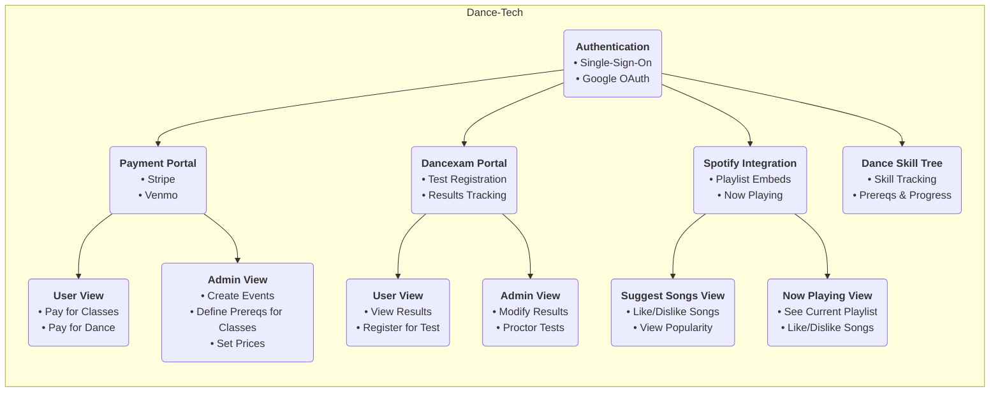

# Dancetech

## About

This is a 4-pronged dance technology infrastructure setup, originally created for the Greenville Westies, but designed with flexiblity in mind.

### Architecture



## Developer Notes

This application is containerized, and was also developed in a dev container. Everything within the .devcontainer folder defines the configuration
for the dev container, and the other docker files out here define how to create the production containers. 

### Getting Started

#### Development Environment

The dev environment for this project is a dev container. The dev container pins the `rust` version. To update that, configure the `.devcontainer/Dockerfile`.

##### VSCode Development

To use `vscode` to develop, uncomment the line that says 'uncomment me for vscode' in the `.devcontainer/Dockerfile` and comment out the `neovim` section. Similarly, comment out the `neovim` volume mappings in the `.devcontainer/docker-compose.yml` file. Then using the command menu, open the root of this repository as a dev container. You are now setup.

##### Neovim Development

The repository is currently set to use `neovim` for development. To start the dev container ecosystem, run the command `sudo -E docker compose up --build` from the `.devcontainer/` directory. Then, to develop within that container, run `sudo docker ps`, and get the name of the `app` container. Then run the command `sudo docker exec -it devcontainer-app-1 bash`. You are now within the container and should be able to use `neovim`. Note that there are volume mappings to get your current `neovim` settings from your home directory (this is why we run `sudo **-E** docker compose up`). You will need to manually run the commands to migrate the database: `sqlx database create && sqlx migrate run` the first time you start the dev container ecosystem. This can be done once `exec'ed` into the dev container.

#### Environment Variables

The dev container will attempt to load the environment variables from a `.env_prod` file, as defined in the `.devcontainer/Dockerfile.`. Create and populate that `.env_prod` file, using the `generate_keys.sh` script to generate two sets of keys for the access and refresh tokens.

#### Updating Tailwind

The `tailwindcss` executable is too large for GitHub. The following commands will download and move the `tailwindcss` executable to where it should be for this project. Update the version if you want.

```bash
curl -sLO https://github.com/tailwindlabs/tailwindcss/releases/download/v4.1.5/tailwindcss-linux-x64
chmod +x tailwindcss-linux-x64 
mv tailwindcss-linux-x64 tailwind/tailwindcss
```

### Development Workflow

Tailwind must be rebuilt everytime you make changes to the html classes. That can be done with the `tailwind/tailwindcss` executable.

`./tailwind/tailwindcss -i ./static/css/input.css -o ./static/css/output.css -c ./tailwind/tailwind.config.js`

If you want to automagically recompile your Rust executable and rebuild your css everytime you save a file, you can run this command.

`cargo watch -s './tailwind/tailwindcss -i ./static/css/input.css -o ./static/css/output.css -c ./tailwind/tailwind.config.js && cargo sqlx prepare && cargo run' --ignore output.css --ignore flowbite.min.css --ignore .sqlx --ignore main.rs --ignore README.md --why`

For some reason the `cargo sqlx prepare` command changes the permissions on the `main.rs` file, which was causing cargo watch to fire repeatedly. That is why we added `--ignore main.rs`. 
The `cargo sqlx prepare` command allows sqlx to compile even when the database is offline. 

### Launching Production Containers

To build the two environments locally:

`ENV_FILE=.env_prod DOCKER_PORT_MAPPING=7000 SERVER_PORT=8000 PG_ADMIN_DOCKER_PORT_MAPPING=7001 docker-compose -p dancexam-prod up --build`

`ENV_FILE=.env_demo DOCKER_PORT_MAPPING=7002 SERVER_PORT=8000 PG_ADMIN_DOCKER_PORT_MAPPING=7003 docker-compose -p dancexam-demo up --build`

### Updating Flowbite + HTMX

#### Flowbite

Run the following commands to install Flowbite. Update the version first. [Why didn't I use CDNs?](https://blog.wesleyac.com/posts/why-not-javascript-cdn)

```bash
curl -LO https://cdn.jsdelivr.net/npm/flowbite@3.1.2/dist/flowbite.min.css
mv flowbite.min.css static/css/
curl -LO https://cdn.jsdelivr.net/npm/flowbite@3.1.2/dist/flowbite.min.js
mv flowbite.min.js static/js
```

#### HTMX

Run the following commands to install HTMX. Update the version first. [Why didn't I use CDNs?](https://blog.wesleyac.com/posts/why-not-javascript-cdn)

```bash
curl -LO https://unpkg.com/htmx.org@2.0.4/dist/htmx.min.js
mv htmx.min.js static/js/
```

### Odd Errors

#### `static/` Not Served Properly (404 Errors on Assets)

Ensure you are launching the server from the root of this repository. File paths are relative to the directory that the server is launched from.

## To Do:

- Change password via email link
- Exam Queue
- User Exam Dashboard
    - Explanation of exams
    - View of exam queue
    - Signed in users can view past exam results
    - Export exam data
- Admin Dashboard
    - Let admins add/remove roles from users
    - Trigger product update
- Proctor Exam Dashboard
    - Exam search by user, exam name, proctor, etc.
    - Export exam data
- Exams
    - Link exams to users by email
    - Fix styling on exam page
    - Email users
    - Have exams apply roles to users
- Check-In
    - Parse role requirements from Stripe API
- Make primary colorscheme look less dumb
- Modify check-in page to only show check-in options based on user roles

## Time Spent

5/1/2025: 3 hrs
5/3/2025: 8 hrs
6/8/2025: 4 hrs
6/9/2025: 7 hrs
6/10/2025: 2 hrs
6/11/2025: 8 hrs
6/14/2025: 3 hrs
6/15/2025: 4 hrs
6/16/2025: 8 hrs
6/18/2025: 3 hrs
6/19/2025: 4 hrs
6/20/2025: 1.5 hrs
6/21/2025: 2 hrs
